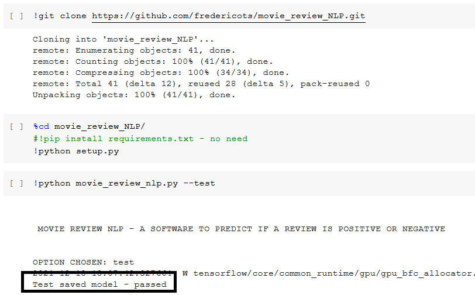
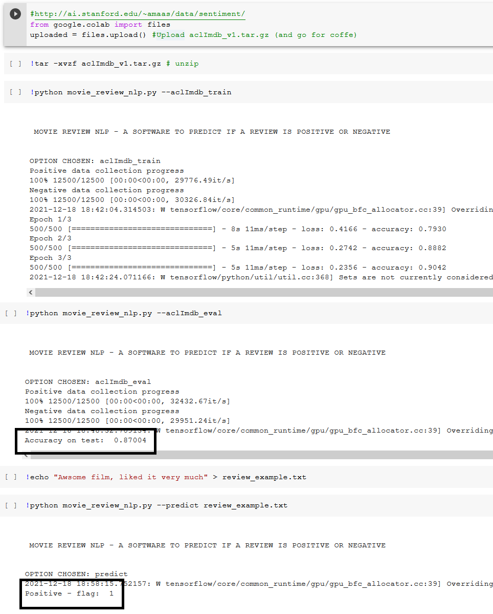

# movie_review_NLP

Movie review NLP is a software to predict if a movie review is positive or negative with
just its text (only english is supported).

## How to install

pip install requirements.txt  
python setup.py

## How to use

After installation you can have available options typing:  

python movie_review_nlp.py -h  

Here we have:  
  **-h, --help**:         show this help message and exit  
  **--test**:             Run test to check installation  
  **--aclImdb_train**:    Train a model using aclImdb data - see data_collection.py for details  
  **--aclImdb_eval**:     Evaluation results with the trained model and aclImdb test data.
  **--predict PREDICT**:  Predict if a text in english is a positive review or a negative one. Needs the .txt path with the text to be predicted  

## About the reference data

The aclImdb data cited here can be found in the following website:

http://ai.stanford.edu/~amaas/data/sentiment/

It is assumed that the data will be in movie_review_nlp directory.
You can change this path on data_collection.py on the following variable:

DATA_IMDB_PATH = "aclImdb/"

## Experiments

All developed models and tests are present in the experiments.ipynb notebook.

## Libraries used

nltk, tensorflow, pandas, jupyter, numpy, keras, scikit-learn and pickle  
All of them are included in requirements.txt:

## Installing on Google colab

The image below show the installation and test of this software at google colab.

## Running on Google colab

The image below show an example of each of the commands available for this program

